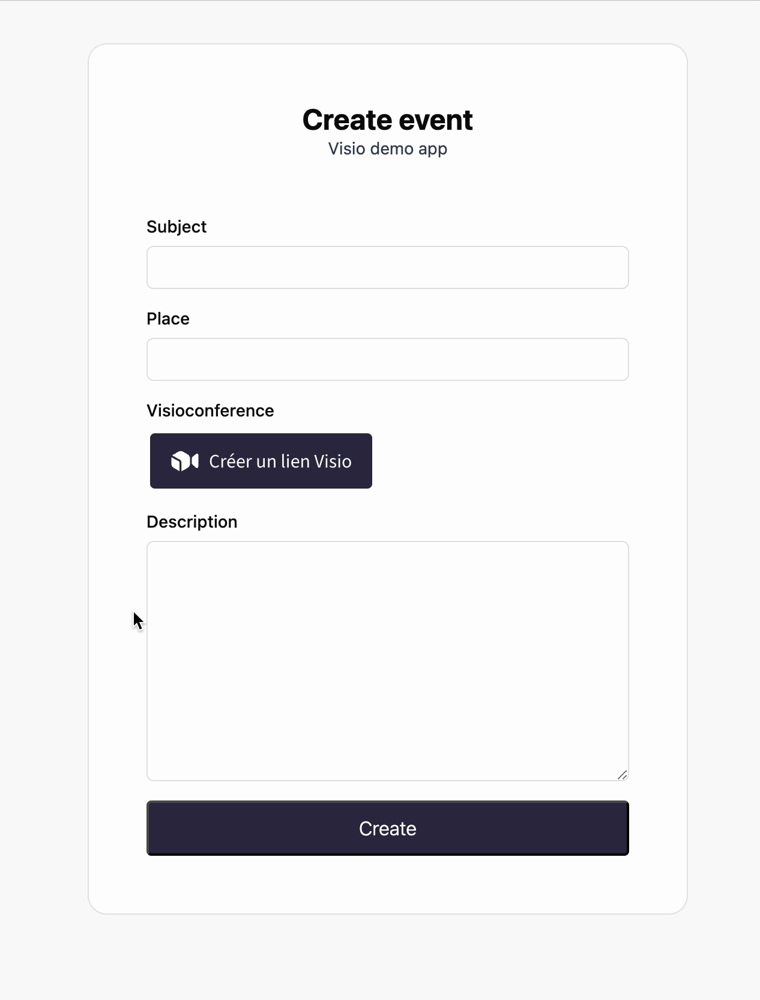
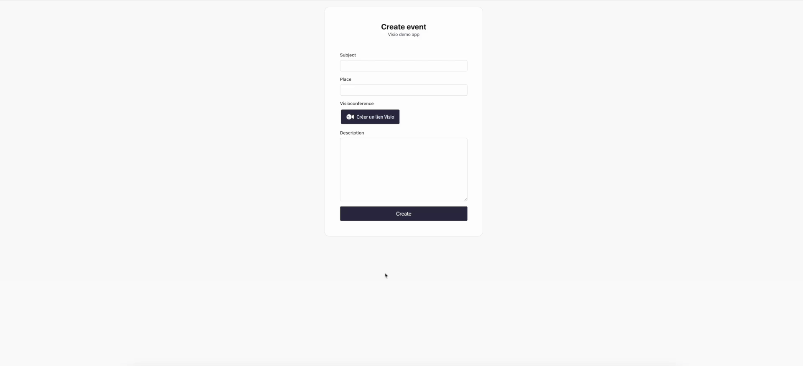

<div align="center">

# 🎥 Visio SDK

**Easily add a button to create visio link to your product**



<br/>
<br/>
<strong>... that also handles seamless authentication out of the box</strong>
<br/>
<br/>



<br/>
<br/>
<strong>As simple as</strong>
<br/>
<br/>

</div>

```ts
import { VisioCreateButton } from "@gouvfr-lasuite/visio-sdk";

function App() {
  const [roomUrl, setRoomUrl] = useState();

  return <VisioCreateButton onRoomCreated={setRoomUrl} />;
}
```

## Installation

To install, you can use npm or yarn:

```
$ npm install --save @gouvfr-lasuite/visio-sdk
$ yarn add @gouvfr-lasuite/visio-sdk
```
